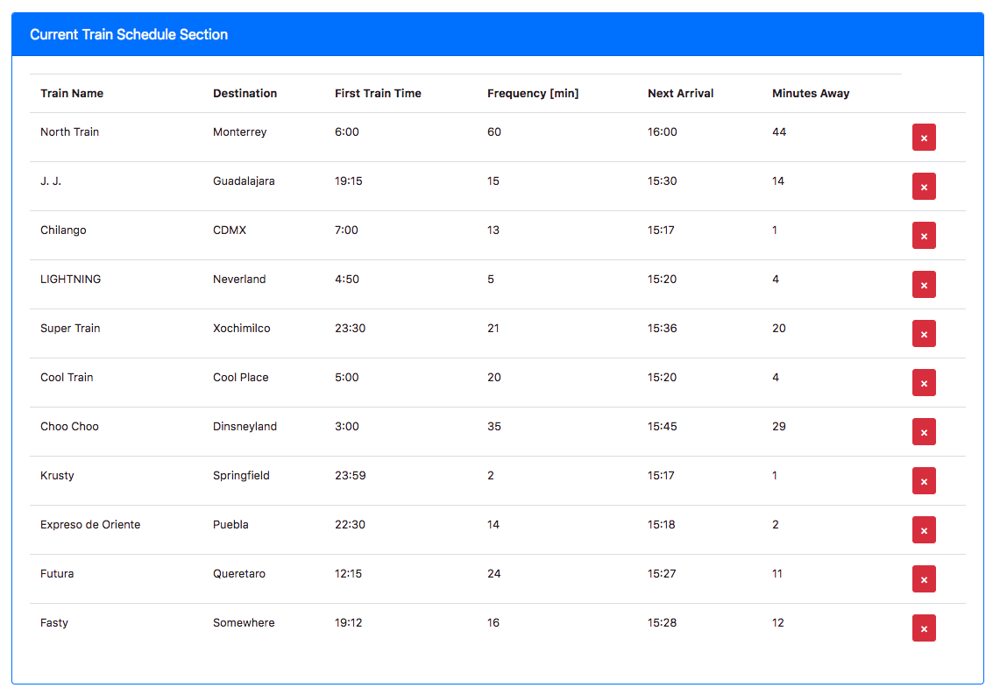
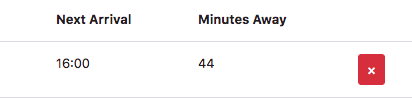
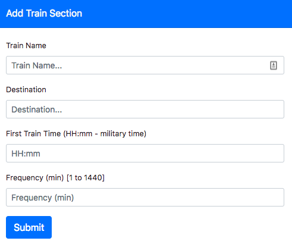

# Train Scheduler App

[Live Demo https://seiji13r.github.io/2018codingBootcampCoursework/07-HW-Firebase/TrainScheduler](https://seiji13r.github.io/2018codingBootcampCoursework/07-HW-Firebase/TrainScheduler)

This App allow the user to visualize the table of Simulated train departures. I will also enable the user to feed the system with new train departures and remove the ones unwanted.

This app has been designed to be responsive which means is usable in Laptops and Mobiles.

# USAGE

## Visualize the Train Schedule

On the table the User can visualize information such as:
* Train Name
* Destination of the Trip
* At what time the first train departed.
* What is the frequency of the following departures
* The Next train Arrival.
* How many minutes remains for the next departure.



## Remove the Record

The User can remove the whole record from the database by clicking the Red Button.



## Add New Train

At the very bottom the User is provided with a Form which enable him to add the information of a new train record.



NOTE: The Form contains validators to prevent invalid data to go into the database

# Development NOTES

## Development Process
### Creating the Main App Page

By Following the Provided Wireframe
We started with:
* Bootstrap Started Template
* jQuery Library updated with the latest completed one. (The slim version has issues with some bootstrap dynamic components).
* Firebase library integration. `This need to be reviewed to only import the used components`
* CDN of moment.js included.
* Linked 'assets/css/style.css' ``Personal CSS File``
* Linked 'assets/javascript/app.js' ``Our Application resides here``

## Firebase Notes
It is important to remember to include the firebase library at the very top of the application as well as the initial configuration of the database (The last one will be specific for your firebase account)

In the code below we list and explain the Firebase Realtime database Methods used in this project.

```javascript
// Initialize the Database where "config" is an object with firebase configuration.
firebase.initializeApp(config);
// Variable to Reference the database.
var database = firebase.database();

//Upload a new record
// Where dbRecord is the new object to be inserted in the Database.
database.ref().push(dbRecord);

// The following Method will hep us to read all the database and return it to the snapshot variable in the following cases.
// 1. When the page load by the first time.
// 2. When a new record is added to the database.
database.ref().on("child_added", function(snapshot) {}

// The following method will remove an specific record by passing to it the Key of the record.
database.ref().child(key).remove();
```

## Form Notes
```html
<!--
Form Text Input Element Template
-->
<div class="form-group">
    <label for=""></label>
    <input type="text" class="form-control" id="" placeholder="">
</div>
```

## Inserting new Data
Under this event listener we enable the application to add new records.

This is the high level logic implemented:
1. Bind a click event on the "#add-train" button.
2. Prevent the default behavior of the Submit Button in Forms.
3. Run the Routine to validate that all the information captured in the Form is valid. this is a user defined function named `isFormValid()`
4. Store the input data into a Javascript Object.
5. Push the created objet into the Firebase Database.

```javascript
// Add-Train Button
$("#add-train").on("click", function(event) {
    // Prevent the default behavior of Form' Submit button
    event.preventDefault();

    // Validate Form
    if (isFormValid()){
        // If form is Valid Push the information to the Database.
        // Capture values from input text boxes and build the object dbTrainRecord
        let dbTrainRecord = {
            trainName : trainNameInput.val().trim(),
            destination : destinationInput.val().trim(),
            firstTrainTime : firstTrainTimeInput.val().trim(),
            frequency : frequencyInput.val().trim(),
            dateAdded: firebase.database.ServerValue.TIMESTAMP
        };
        
        // Code for handling the Push
        database.ref().push(dbTrainRecord);

        console.log(dbTrainRecord)
        console.log("Train Successfully Added");
        clearInputs();
    } else {

    }
});
```

# Validating the Form Before 
```javascript
// Function to Validate if the Data in the Form is Valid
// It will check each Field for Valid Information
let isFormValid = function(){
    // Form valid Called
    // console.log("Form Valid Function Called");
    
    // Local Variables to Store Input Values.
    let trainName = trainNameInput.val().trim();
    let destination = destinationInput.val().trim();
    let firstTrainTime = firstTrainTimeInput.val().trim();
    let frequency = parseFloat(frequencyInput.val().trim());
    // console.log("Frequency: " + frequency);

    // Failed Flag
    let passed = true;
    
    // Form Validators

    // Train Name Validator
    if(trainName===""){
        trainNameInput.addClass("is-invalid");
        msgTrainName.text("Please Provide a Train Name");
        passed = false;
    }
    else{
        trainNameInput.removeClass("is-invalid");
        msgTrainName.text("");
    }

    // Destination Validator
    if (destination===""){
        destinationInput.addClass("is-invalid");
        msgDestination.text("Please Provide a Destination");
        passed = false;
    } 
    else {
        destinationInput.removeClass("is-invalid");
        msgDestination.text("");
    }

    // First Train Time Validator
    // console.log("hhmmKeyRegExp: ", hhmmKeyRegExp.test(firstTrainTime));
    if(!(hhmmKeyRegExp.test(firstTrainTime))){
        firstTrainTimeInput.addClass("is-invalid");
        msgFirstTrainTime.text("Please Check the Format HH:mm");
        passed = false;
    }
    else {
        firstTrainTimeInput.removeClass("is-invalid");
        msgFirstTrainTime.text("");
    }

    // Frequency Validator
    if(isNaN(frequency)||(frequency<=0)){
        frequencyInput.addClass("is-invalid");
        msgFrequency.text("Please Provide a Valid Frequency");
        passed = false;
    }
    else {
        frequencyInput.removeClass("is-invalid");
        msgFrequency.text("");
    }

    // Debugging Code
    // Activate All Error Messages
    // trainNameInput.addClass("is-invalid");
    // msgTrainName.text("Error");
    // destinationInput.addClass("is-invalid");
    // msgDestination.text("Error");
    // firstTrainTimeInput.addClass("is-invalid");
    // msgFirstTrainTime.text("Error");
    // frequencyInput.addClass("is-invalid");
    // msgFrequency.text("Error");

    if(passed){
        // Form Valid Message
        console.log("The Data Form is Valid");
        // Reset Form Elements to Natura State
        trainNameInput.removeClass("is-invalid");
        msgTrainName.val("");
        destinationInput.removeClass("is-invalid");
        msgDestination.val("");
        firstTrainTimeInput.removeClass("is-invalid");
        msgFirstTrainTime.val("");
        frequencyInput.removeClass("is-invalid");
        msgFrequency.val("");
        return true;
    }
    
}
```