# Liri App

## Introduction
LIRI is like iPhone's SIRI. However, while SIRI is a Speech Interpretation and Recognition Interface, LIRI is a Language Interpretation and Recognition Interface. 

LIRI is a command line NodeJS Application that takes in typed parameters and gives you back data.

[Download](https://github.com/seiji13r/2018codingBootcampCoursework/raw/master/10-HW-NodeJS/liri-node-app.zip)

TABLE OF CONTENTS
=================
- [Liri App](#liri-app)
    - [Introduction](#introduction)
- [Usage](#usage)
    - [Usage Demo](#usage-demo)
- [Requirements](#requirements)
- [Installation](#installation)
- [Configuration](#configuration)
- [API Keys Request](#api-keys-request)
    - [Spotify](#spotify)
    - [OMDB API](#omdb-api)
    - [Bands in Town API](#bands-in-town-api)
- [Configure the .env file with the API Keys](#configure-the-env-file-with-the-api-keys)
- [API keys](#api-keys)
- [How it was build?](#how-it-was-build)
- [Code Explained](#code-explained)

# Usage

liri app has the following 4 command options:
* concert-this
* spotify-this-song
* movie-this
* do-what-it-says
* help

node liri `concert-this` [Artist]: This will list all comming shows Dates and Locations of that Artist.

> When Concert This command is incomplete the output will Warn that situation.

node liri `spotify-this-song` [Song]: This will list all Spotify Album conincidences.

> When Spotify-This command is incomplete the output will be the info from the song "The Sign" of Ace of Base.

node liri `spotify-this-song` [Movie Name]: This will list the information of the Given Movie.

> When Movie-This command is incomplete the output will be the info from the Movie "Mr. Nobody".

node liri `do-what-it-says`: This will choose randomly one of the commands in the file random.txt and it will execute it.

## Usage Demo

Click on the Image to download the video.

# Requirements

* Node JS Installed in the Server or Personal Computer
* Download the Project Directory and Install the Dependencies with npm -i
* Request the API Keys of (Spotify, OMBD and BandsInTown)
* Create the file `.env` and fill it with your Personal API Keys.

# Installation


# Configuration

# API Keys Request

## Spotify

Visit [https://developer.spotify.com/dashboard/](https://developer.spotify.com/dashboard/)

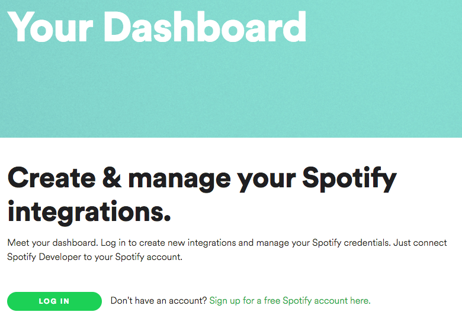

Click on Login if you have a Spotify (Premium or Free) Account or Register a new Account
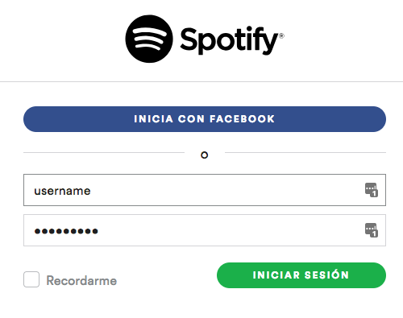

Read and Accept the Terms of Service.

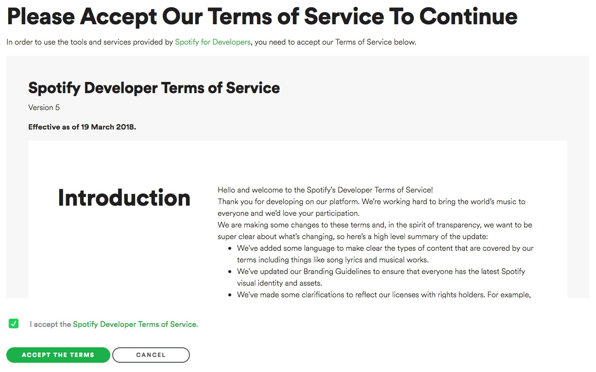

Click on a Create a Client ID
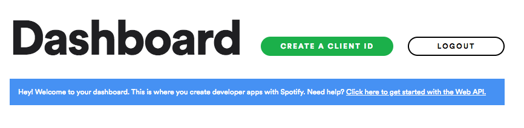

**Warning!!** The following Instructions work are for non-comercial use

Provide an App Name and a Description.

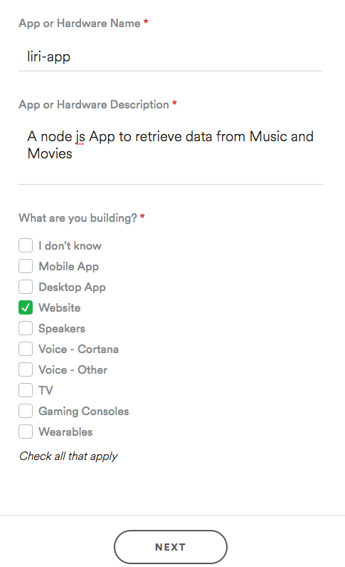

Follow the next screenshots for non-coercial Application

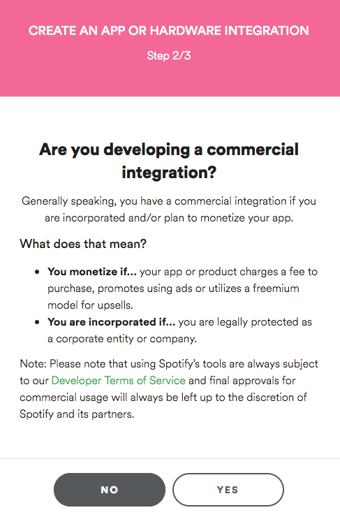
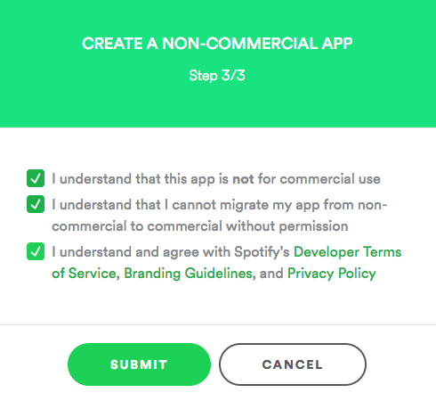

Get your `ClientID` and your `Client Secret` in the next Screen

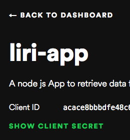

## OMDB API

Visit [OMDB Api http://www.omdbapi.com/](http://www.omdbapi.com/)

Click on API Key

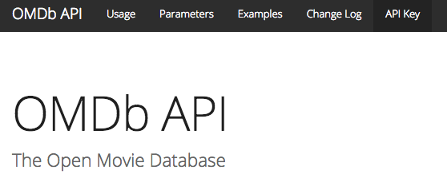


Select a Free Key for test purposes and Fill the Key Request Form.

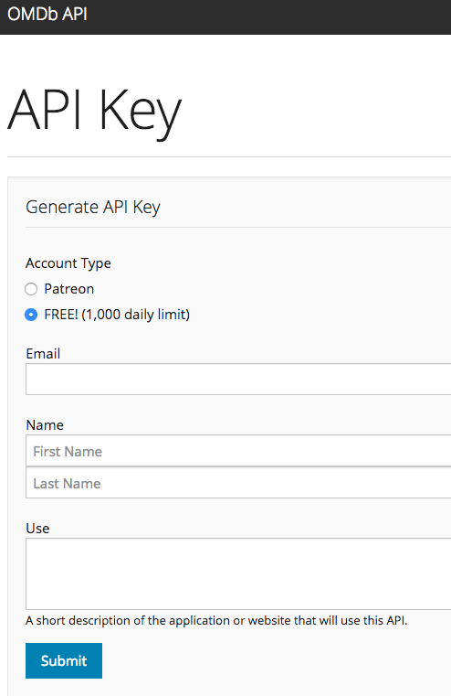


Once you receive the email click on the provided link to activate the key.

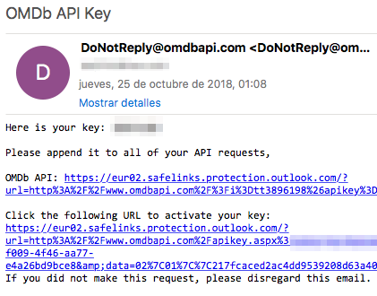

## Bands in Town API

Visit [The Bands in Town API Site http://www.artists.bandsintown.com/bandsintown-api](http://www.artists.bandsintown.com/bandsintown-api)

Follow the Step by Step guide to request the API key
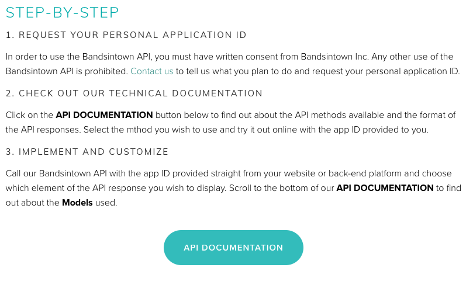

# Configure the .env file with the API Keys

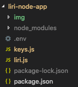

The `.env` file should be placed aside the `keys.js` and `liri.js` and should contain the following including the API Keys requested before.

```bash
# API keys

SPOTIFY_ID=your-spotify-id
SPOTIFY_SECRET=your-spotify-secret
OMBD_API_KEY=your-ombd-api-key
BANDSINTOWN_API_KEY=your-bands-in-town-key
```

# How it was build?
* Application file structure initially created.
* Node JS Project initialized with npm init.
* External Modules Installed.
    * [node-spotify-api](https://www.npmjs.com/package/node-spotify-api)
    * [request](https://www.npmjs.com/package/request)
    * [moment](https://www.npmjs.com/package/moment)
    * [dotenv](https://www.npmjs.com/package/dotenv)
* packege.jason verified.
* Command Line Arguments Verification Routines Implemented.
* Break Down with Switch/Case for each Command Option.
* API Keys Request for Spotify, OMBD and Bands In Town.
* Resolve the Isolation of these Confidential data Keys into a single file `.env` and invoke it from within the javascript.
* Encapsulate in Functions each Command Option Functionality.
* Importing Requiered Modules and Assigned to Variables inside the Program.
* Resolving each Function Functionality. NOTE: "The result output is Stored in a String before log it in the console"
* Encapsulating the main program into a function so we can call it from within the program.
* Implementing the File Logging functionality to capture all program outputs to keep track of usage.
  
# Code Explained