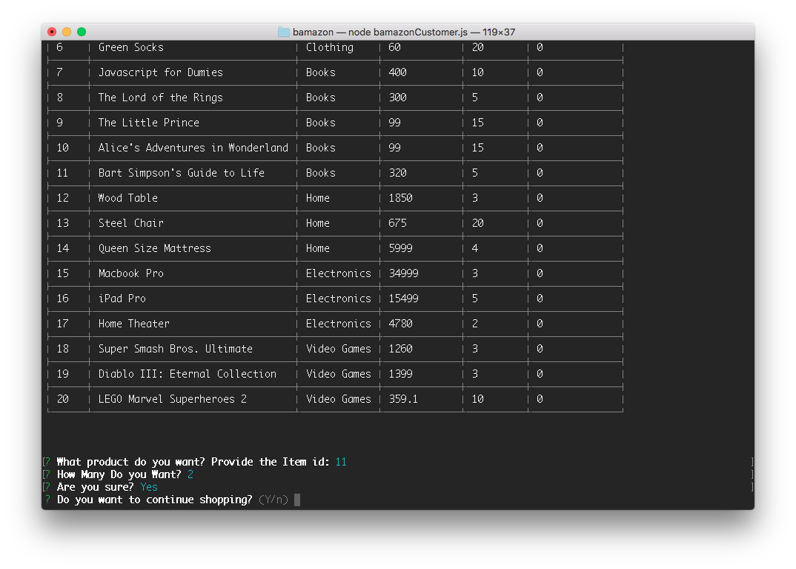
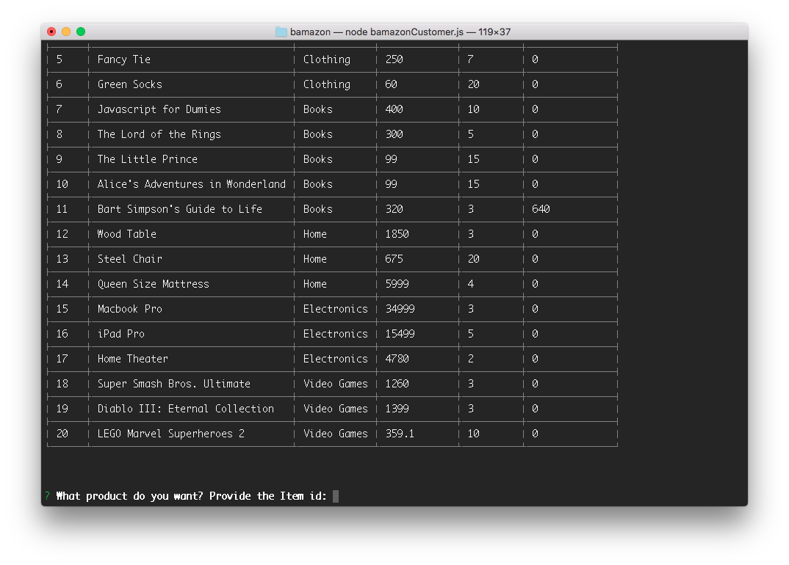
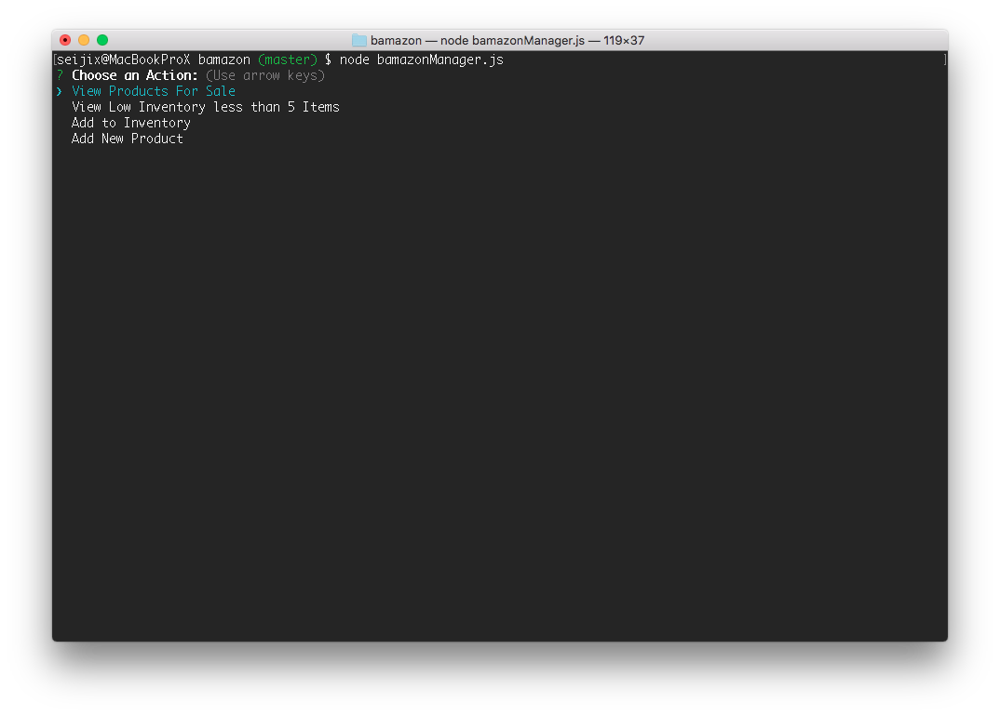
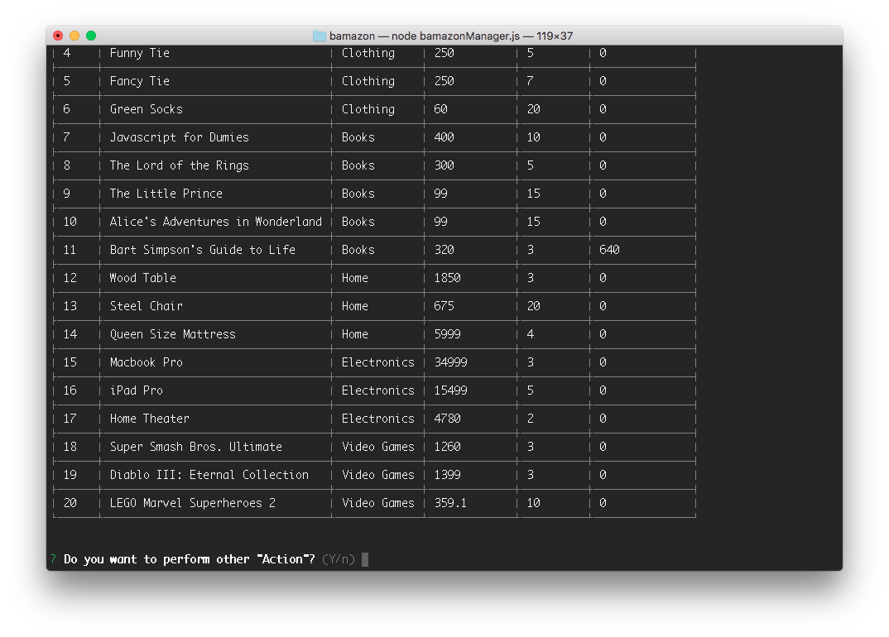
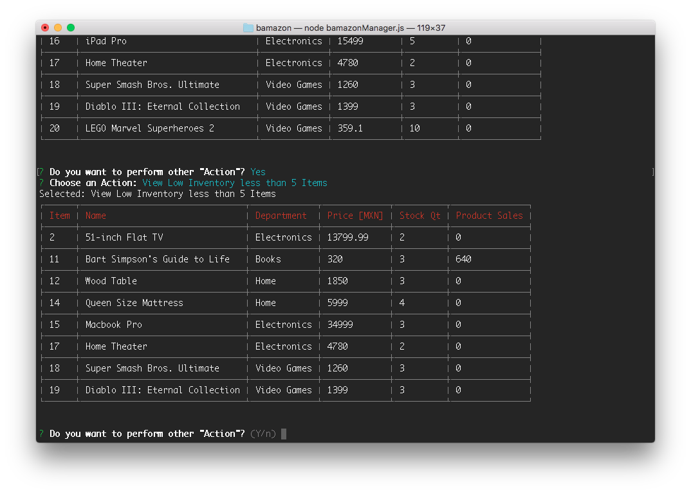
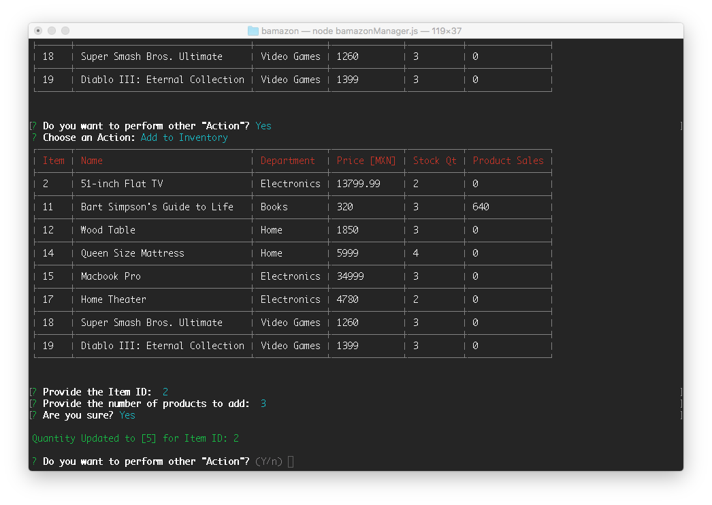
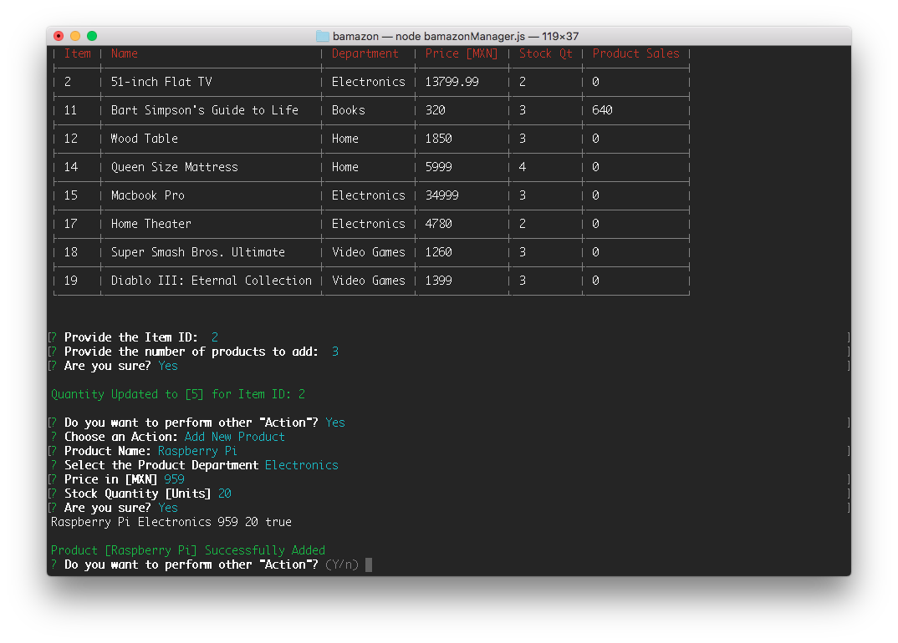
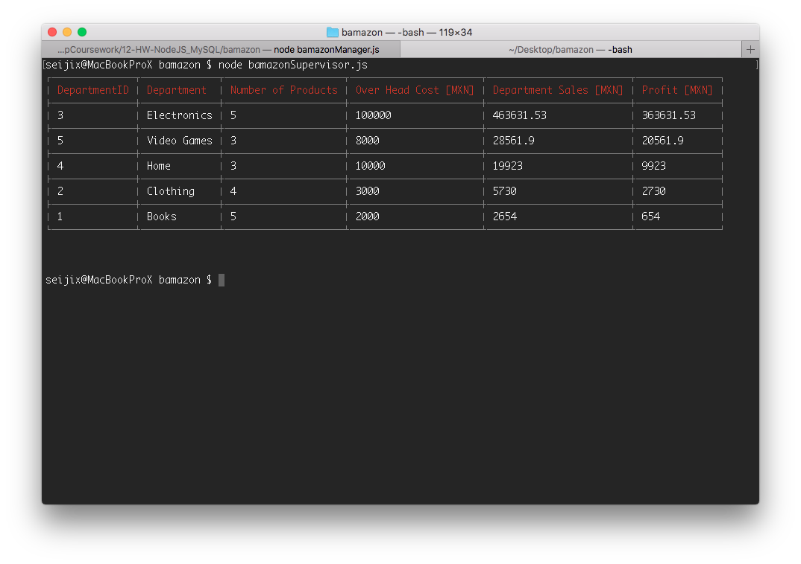

# NodeJS and MySQL

<!-- TOC -->

- [NodeJS and MySQL](#nodejs-and-mysql)
- [Overview](#overview)
    - [Video Demo](#video-demo)
    - [ScreenShots](#screenshots)
        - [bamazonCustomer.js](#bamazoncustomerjs)
        - [bamazonCustomer.js](#bamazoncustomerjs-1)
        - [bamazonSupervisor.js](#bamazonsupervisorjs)
- [Installation](#installation)
    - [Requirements](#requirements)
    - [Step by Step installation](#step-by-step-installation)
        - [MySQL Connection Settings](#mysql-connection-settings)
    - [Video Installation Walk Trough](#video-installation-walk-trough)
- [Configuration](#configuration)
- [Development](#development)
    - [Dependencies](#dependencies)
    - [Development Process](#development-process)
    - [Development Notes](#development-notes)
        - [Functions Relationship](#functions-relationship)
            - [bamazonCustomer.js](#bamazoncustomerjs-2)
            - [bamazonManager.js](#bamazonmanagerjs)
            - [bamazonSupervisor.js](#bamazonsupervisorjs-1)
        - [bamazonSupervisor.js SQL query construction.](#bamazonsupervisorjs-sql-query-construction)

<!-- /TOC -->

# Overview

This `bamazon` Project ilustrates the usage of NodeJS along with MySQL database.

This project simulates a simplified version of an online Store.

The project database contains 2 tables. Store Products [`products`] and Store Departments [`departments`].

The package contains 3 main nodejs command line programs which provides business actions against the Database of 3 different roles.

* Customer: [*bamazonCustomer.js*] - Can purchase products from the **Store** and keep the **Inventory** up to date automatically.
* Manager: [*bamazonManager.js*] - Can *visualize* the **Stock** Can add *supply* the **Inventory** and *add* **Products**.
* Supervisor: [*bamazonSupervisor.js*] - Can obtain a per *Department* **Sales Performance Report**.

[Source Code](https://github.com/seiji13r/2018codingBootcampCoursework/tree/master/12-HW-NodeJS_MySQL/bamazon/)

## Video Demo

[bamazonCustomer.js Demo Video](https://drive.google.com/open?id=1l8V8sfMqSTv-e3_NYR017kW9aNncsWJ-)

[bamazonManager.js Demo Video](https://drive.google.com/open?id=1hszmqpeiw4CmEUDS6Be7tRx6RZO5Csxf)

[bamazonSupervisor.js Demo Video](https://drive.google.com/open?id=17bQYqZRZM7W83IGEYkQ2231YkPrA9IdO)

## ScreenShots
### bamazonCustomer.js
Products Table

Buy Products by ID


### bamazonCustomer.js
Manager Menu

Manager (Display Products)

Manager (Display Products with Low Inventory)

Manager Add Products to the Stock

Manager add New Product


### bamazonSupervisor.js


# Installation

## Requirements
* NodeJS 8.x or above installed.

## Step by Step installation  
* Download the Package [[DownloadLink]](https://github.com/seiji13r/2018codingBootcampCoursework/blob/master/12-HW-NodeJS_MySQL/bamazon.zip?raw=true)
* Unzip the package locally anywhere. 
* cd into the bamazon directory.
* Install all npm dependencies with `npm install`.
* Create the `.env`file and update MySQL connection Settings accordingly.
* Open MySQL Workbench or the preferred MySQL GUI client and execute the file bamazon.sql

### MySQL Connection Settings
Create the file .env inside the project directory and write inside it the following.
Update the values accordingly.
```bash
# MySQL CONNECTION SETTINGS
BAMAZON_MYSQL_IP="127.0.0.1"
BAMAZON_MYSQL_PORT=3306
BAMAZON_MYSQL_USER="root"
BAMAZON_MYSQL_PASSWORD=""
BAMAZON_MYSQL_DB="bamazon_db"
```

## Video Installation Walk Trough
[Install the Package and Configure MySQL Connection](https://drive.google.com/open?id=1yVv6YY8pX2_4B6TrrFop19zRfaSJOrTa)

[Populate the data base and test Program](https://drive.google.com/open?id=1wgCy29nsrOW3N2zDYFnqaRizUbfOcYQu)

# Configuration

* Make sure the file .env has been updated.
* Create the Database wih the `bamazon.sql` file provided.

# Development

## Dependencies
* [Inquirer](https://github.com/SBoudrias/Inquirer.js#readme)
* [MySQL](https://www.npmjs.com/package/mysql)
* [dotenv](https://www.npmjs.com/package/dotenv)

## Development Process
* Create the File Structure
* Create the sql files to define the Database and Table structure and include initial data.
* Make sure to install the dependencies **Dependencies** `mysql`, `inquirer`, `cli-table3`.
* Connect with MySQL Database and build the Initial Database with the already written sql file.
* Create the bamazonCustomer.js app.
    * Include the required npm Libraries.
    * Resolve MySQL Connection.
    * Resolve hiding the connection credentials and creating the connection's configuration file.
    * Resolve Displaying the Data with cli-table3.
    * Resolve the user input with inquirer **What?** and **How Many?**.
    * Resolve the Invoice.
    * Resolve the Products table Update.
    * Create a function that will be called at the end of each action to quit the program or keep operating. "This will be the only one ending mysql connection"
* Create the managerCustomer.js app.
    * Include the required npm Libraries.
    * Include  MySQL Connection.
    * Include hiding the connection credentials and creating the connection's configuration file.
    * Create a main function with the Manager's Menu Options.
    * Include the Function to list the Products for sale.
    * Create a Function to display the Inventory (Query quantity < 5) define a callback function as an argument.
    * Create the Update call back function. So it prints the inventory table and then request for the product to add inventory.
    * Create the Add Product Function.
    * Re-Use the function that request to continue or quit the program.
* Create the supervisorCustomer.js app.
    * Include the required npm Libraries.
    * Include  MySQL Connection.
    * Include hiding the connection credentials and creating the connection's configuration file.
    * Resolve the Query to obtain the Sales Performance per Department
        1. Create the query to obtain a report from products table with summarized `product_sales` per Department.
        2. Join the previous table with the Department's table.
        3. From the resulting table create a calculated column with `profit`=`product_sales`-`over_head_cost`.
    * sdafdsf

## Development Notes
### Functions Relationship
#### bamazonCustomer.js
**Asynchronous Functions Relationship**
```console
        displayProducts()
                ^
displayTable()  productSelection()
                        ^
                inventoryUpdate()
                yes             no
                ^        displayProducts()
        continueShopping()
        yes             no
        ^               connection.end()
displayProducts() 
```

#### bamazonManager.js
**Asynchronous Functions Relationship**
```console
-------------------------------managerMenu()-------------------------------------
            ^                       ^                       ^           ^
    displayProducts()   lowInventory(callbackFunc)  addInventory()  addProduct()
        ^       ^              ^            ^           ^               ^
displayTable()  ^        displayTable()     ^           ^               ^
        continueOperations()    continueOperations()    ^       continueOperations()
                ^                        ^        continueOperations()  ^
                ^                        ^              ^               ^
            managerMenu()           managerMenu()    managerMenu()    managerMenu()
```

#### bamazonSupervisor.js
**Asynchronous Functions Relationship**
```console
        displayProfit()
            ^
        displayTable()

```

### bamazonSupervisor.js SQL query construction.
```sql
-- 1. Create the query to obtain a report from products table with summarized `product_sales` per Department.
SELECT department_name, COUNT(*) AS num_products, SUM(product_sales) AS department_sales FROM bamazon_db.products GROUP BY department_name

-- 2. Join the previous table with the Department's table.
SELECT *
FROM bamazon_db.departments
LEFT JOIN
(SELECT department_name, COUNT(*) AS num_products, SUM(product_sales) AS department_sales FROM bamazon_db.products GROUP BY department_name) AS summarized
ON bamazon_db.departments.department_name = summarized.department_name;  

-- 3. From the resulting table create a calculated column with `profit`=`product_sales`-`over_head_cost`.
SELECT departments.department_id, departments.department_name, num_products, over_head_cost, department_sales, (department_sales - over_head_cost) AS profit
FROM bamazon_db.departments
LEFT JOIN
(SELECT department_name, COUNT(*) AS num_products, SUM(product_sales) AS department_sales FROM bamazon_db.products GROUP BY department_name) AS summarized
ON bamazon_db.departments.department_name = summarized.department_name ORDER BY profit DESC;  
```